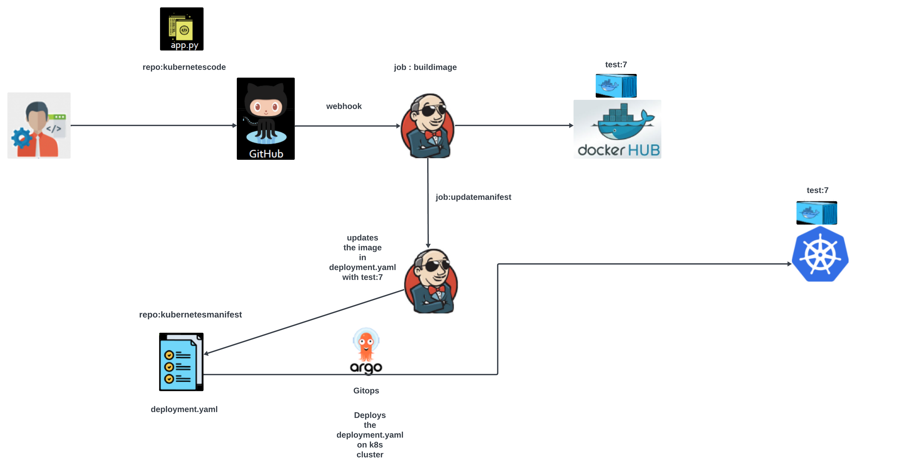

This repo along with https://github.com/Krishnakali-Dutta/kuberenetesmanifest creates a Jenkins pipeline with GitOps to deploy code into a Kubernetes cluster. CI part is done via Jenkins and CD part via ArgoCD (GitOps).

